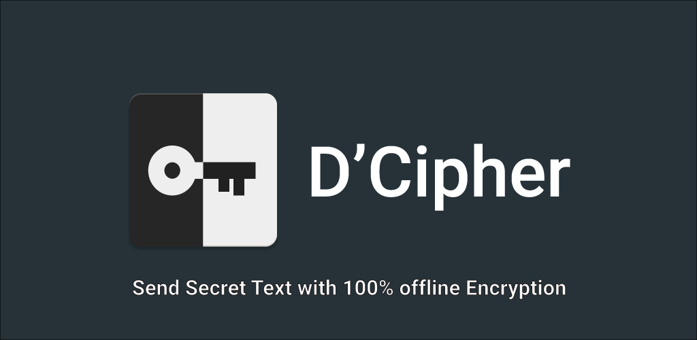
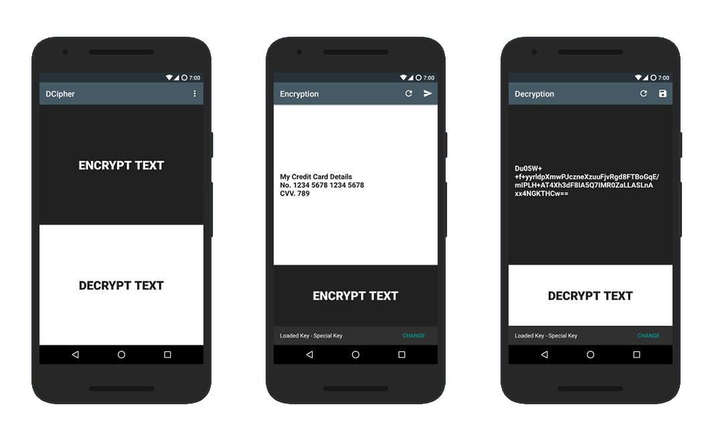

# DCipher :closed_lock_with_key:

Send Secret Messages with 100% Offline Encryption :fire:

## Screens

## Download

## Introduction

D'Cipher helps users to share their sensitive information with control.

Sending sensitive information like **credit card details**, with any online medium is risky these days. We have to trust the medium with our information. :confused:
Some platforms provide end to end encryption or auto destroy text sharing, but we have to trust them anyway.
Here comes The **DCipher**. You don't need to trust anybody, create your own secret key and encrypt text with it and share the text and key with different platforms like sending **Secret Key  on Whatsapp** and **Encrypted Text on Telegram**. You are in control now. :smiley: :v:
You have to share key only once and send multiple secret text receiver. :key:

## Features

* App **doesn't** request any **Internet/Wifi** permission
* Custom Key Generation
* Encrypting Text with custom keys
* Sharing Custom Keys using any platform
* Sharing Encrypted Text with any platform
* Direct To and From File Selectors from messaging and other platforms

Simple way to get started is 
* Create custom Key from Key Manager
* Load that key 
* Share Key with any platform like Email / Messenger
* Encrypt any text and share is as File
* Choose platform to share like Email / Messenger
* Done

Receiver will Tap on key file and import directly to D'Cipher, also Tapping on Encrypted file it will open into D'Cipher for Decryption.

Text encrypted with keys will only be decrypted with same key.
D'Cipher uses 128 bit AES encryption with RSA

## Development

### Prerequisites

- Android Studio 3.1 or above
- Android Device with USB Debugging Enabled

### Built With

* [Android Studio](https://developer.android.com/studio/index.html) - The Official IDE for Android
* [Gradle](https://gradle.org/) - Build tool for Android Studio
* [Kotlin](https://kotlinlang.org) - Official Language for Android Development

### Contributing

Please read [CONTRIBUTING.md](CONTRIBUTING.md) for contributions.

  <h3>Proudly :muscle: made in <b><a href="https://kotlinlang.org/">Kotlin</a></b></h3>

### License
-------
    Copyright 2018 Aditya Kamble

    Licensed under the Apache License, Version 2.0 (the "License");
    you may not use this file except in compliance with the License.
    You may obtain a copy of the License at

        http://www.apache.org/licenses/LICENSE-2.0

    Unless required by applicable law or agreed to in writing, software
    distributed under the License is distributed on an "AS IS" BASIS,
    WITHOUT WARRANTIES OR CONDITIONS OF ANY KIND, either express or implied.
    See the License for the specific language governing permissions and
    limitations under the License.
---
